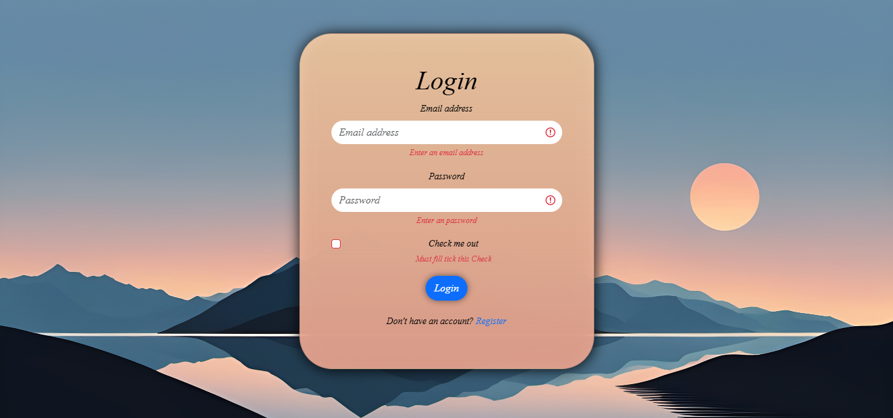
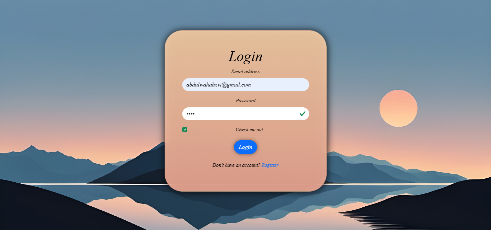
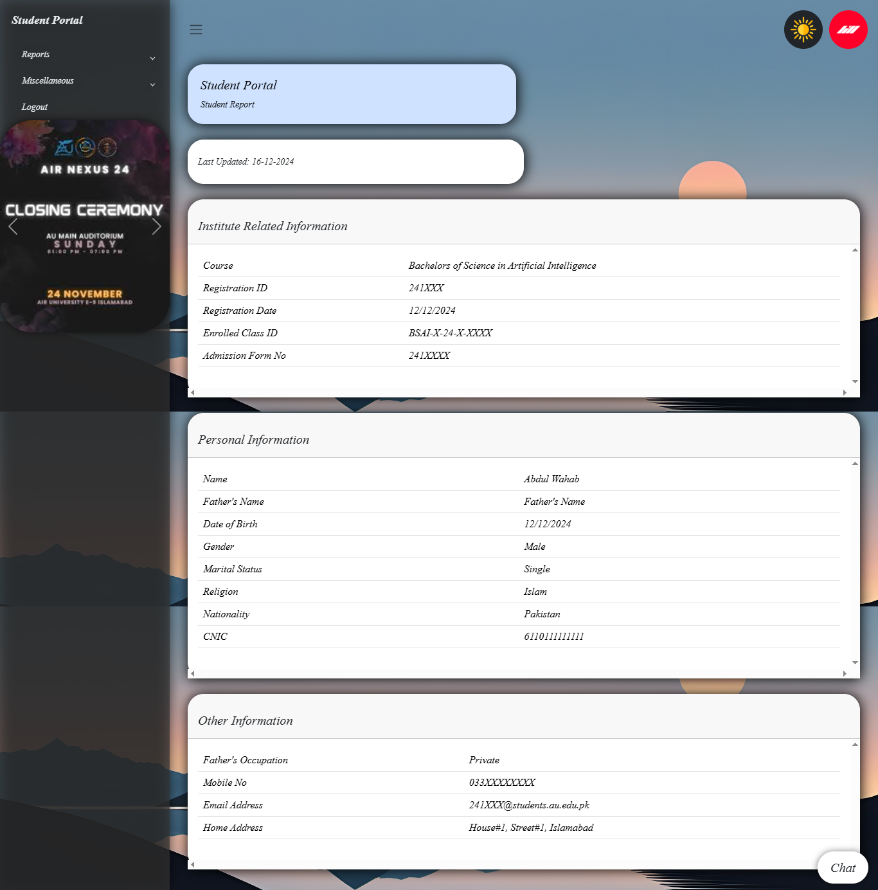
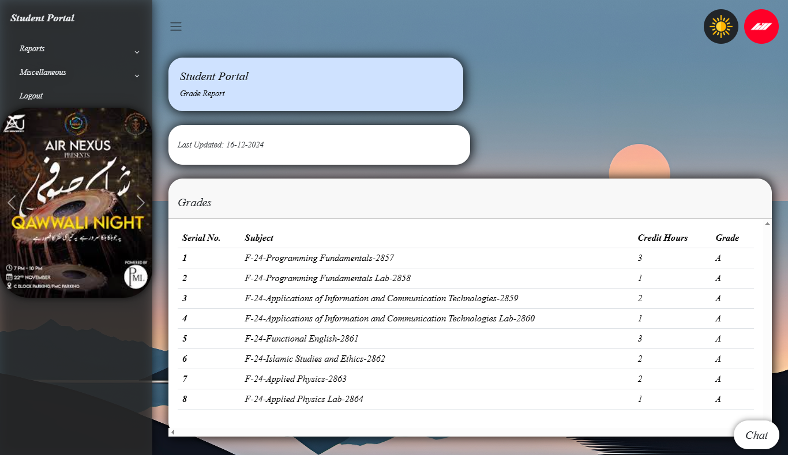
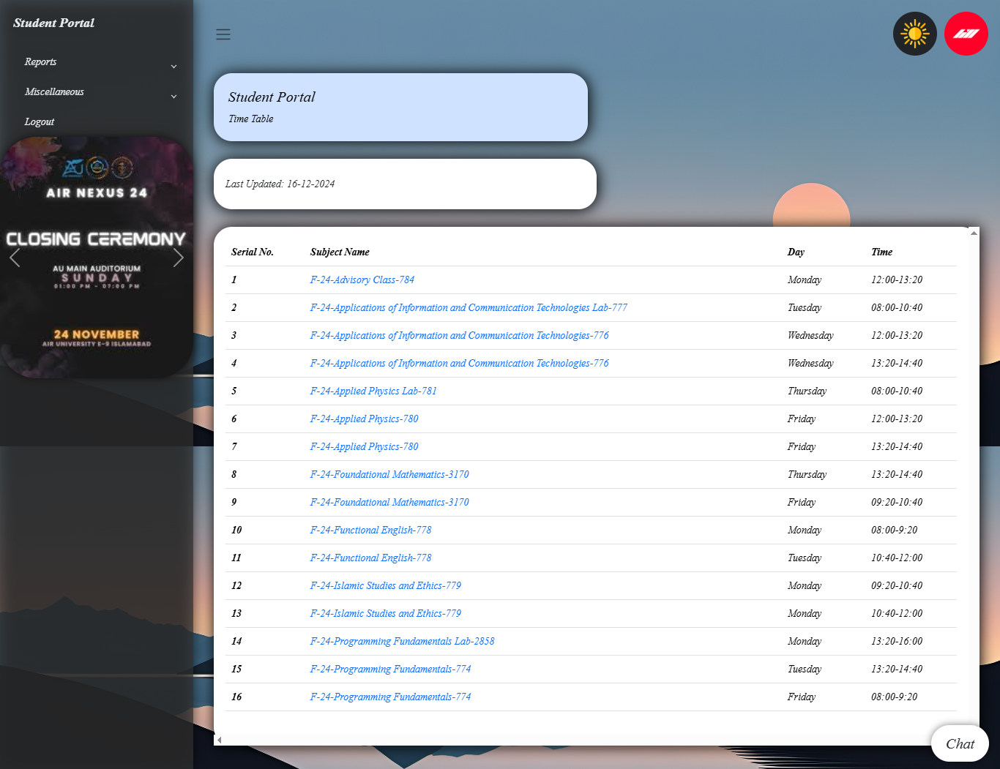
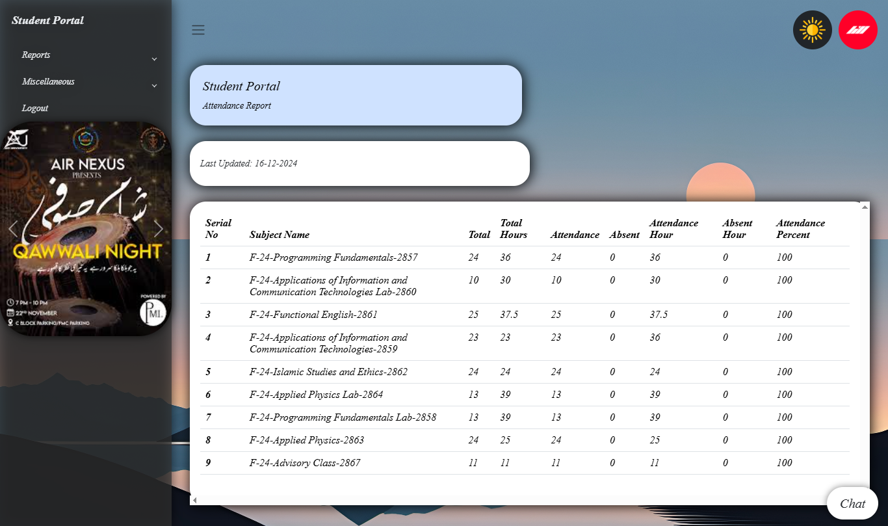
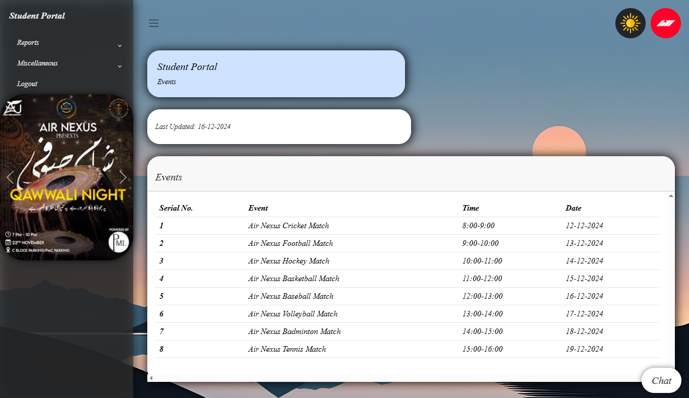
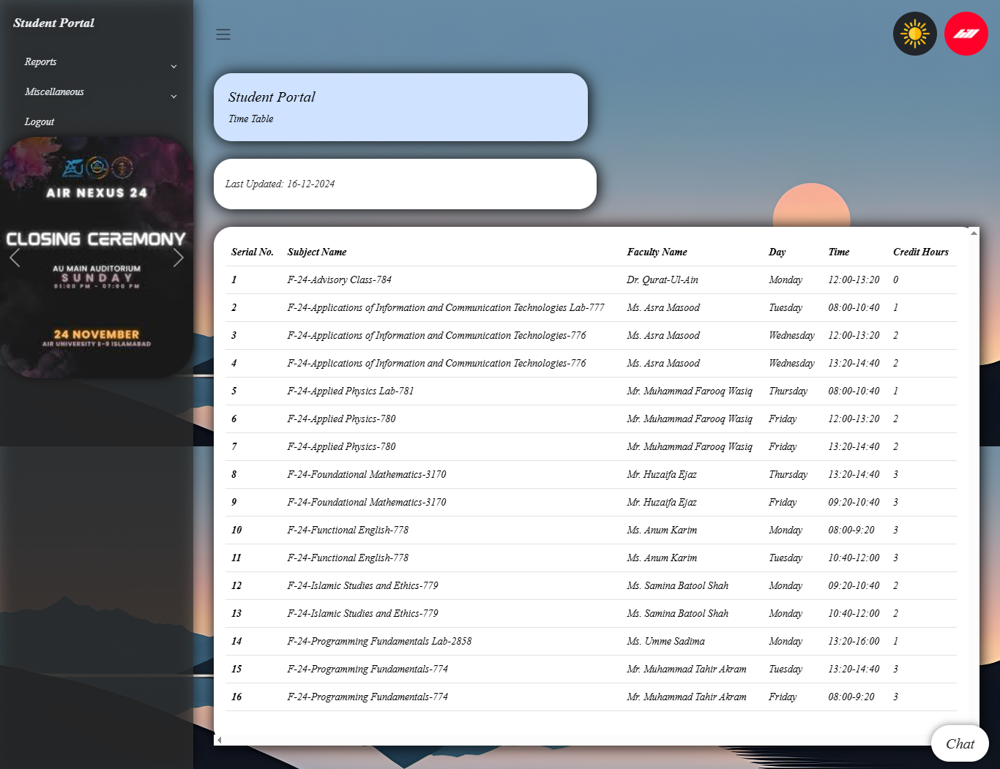
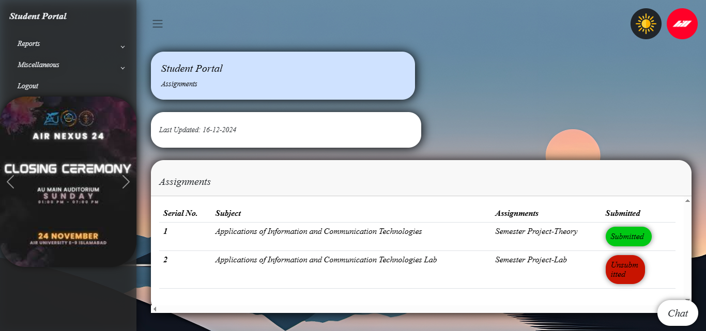

# 🎓 University Student Portal

A simple web-based student portal designed for universities to manage academic activities, communication, and student services in one centralized platform.  

⚠️ This is a **static template**, so it does not include backend functionality or dynamic features.

---

## ✨ Features

- Login Page  
- Personal Profile Page  
- Grades Monitoring Page  
- Attendance Tracking Page  
- View Registered Courses  
- Lecture Schedules  
- Assignment and Quiz Submission Pages  
- Notifications and Event Announcements  

---

## 🛠️ Tech Stack

### Frontend
- HTML  
- CSS  
- JavaScript  
- Bootstrap  

---

## 📂 Project Structure

```bash
university-student-portal/
│
├── .github/workflows/
│   └── static.yml
│
├── images/
│   ├── bg1.jpg
│   ├── bg2.jpg
│   ├── bg3.jpg
│   ├── bg4.jpeg
│   ├── customer-support.jpg
│   ├── dp.png
│   ├── event1.jpeg
│   ├── event2.jpeg
│   ├── event3.jpeg
│   ├── event4.jpeg
│   ├── flaticon.ico
│   ├── moon.png
│   ├── profile.jpg
│   └── sun.png
│
├── js/
│   └── script.js
│
├── assignments.html
├── attendancereport.html
├── coursereport.html
├── events.html
├── gradereport.html
├── index.html
├── marksreport.html
├── register.html
├── registeredcourse.html
├── studentreport.html
├── style.css
└── timetable.html
```

---

## 🚀 Installation

### 1. Clone the Repository
```bash
git clone https://github.com/AbdulWahabXVI/university-student-portal.git
```

### 2. Open Project Folder
```bash
cd university-student-portal
```

### 3. Run Project
Just open:
```text
index.html
```
in your browser.

---

## 📸 Screenshots

- Login Page
  


- Login Validation
  


- Student Dashboard
  


- Grades
  


- Registered Course
  


- Attendance
  


- Events
  


- Time Table
  


- Assignments
  


---

## 📜 License

This project is licensed under the **MIT License**.

---

## 👨‍💻 Author

Developed by **Abdul Wahab**  
University Project
